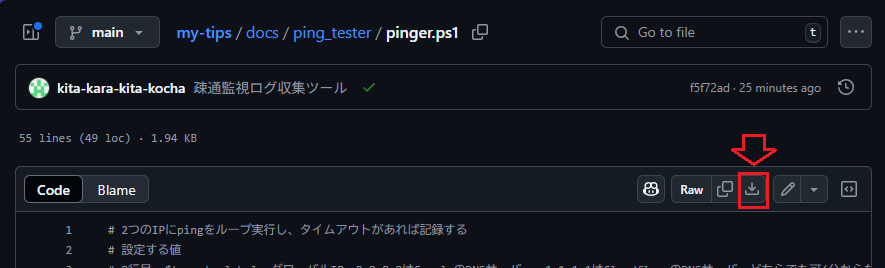
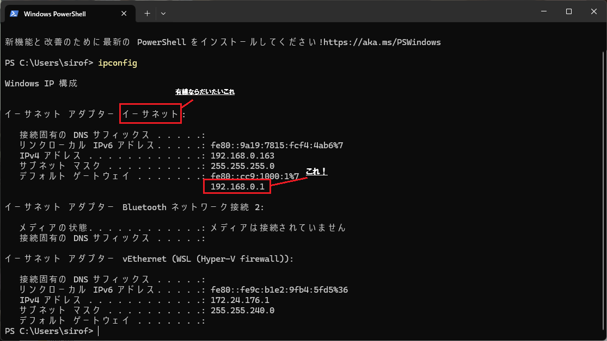
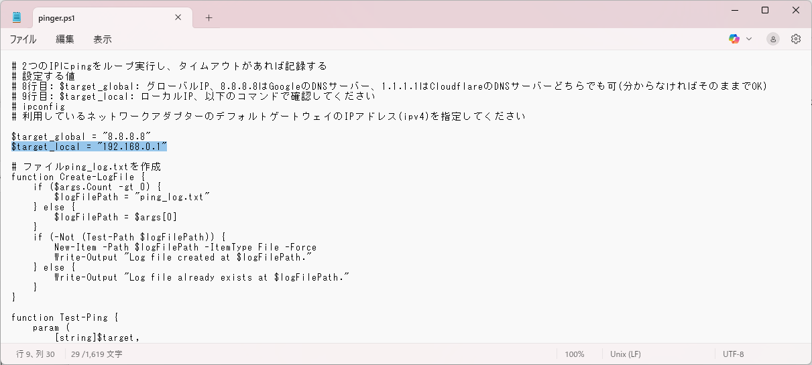
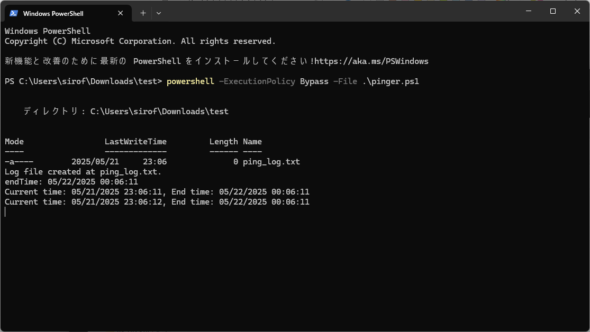

# 疎通確認ログ収集ツール

このツールは、指定した2つのIPアドレスに対して定期的にpingを実行し、タイムアウトが発生した場合にログファイルへ記録します。

## 使い方

1. `pinger.ps1` を任意のフォルダにダウンロードします。

[ここ](./pinger.ps1)からダウンロードできます。


任意のフォルダに保存してください。

2. スクリプト内の以下の変数を編集します。

   - `$target_global`：グローバル疎通確認先IP（例: 8.8.8.8 など）
   - `$target_local`：ローカル疎通確認先IP（例: 192.168.0.1 など。`ipconfig`コマンドでデフォルトゲートウェイを確認）

利用しているネットワークアダプタのデフォルトゲートウェイを確認```ipconfig```

ダウンロードした `pinger.ps1` をメモ帳等で開き、以下の部分を編集します。

9行目
```powershell
$target_local = "192.168.0.1"
```   
↓
```powershell
$target_local = "確認したデフォルトゲートウェイのIPアドレス"
```   


3. PowerShellでスクリプトを実行
   pinger.ps1を保存した任意のフォルダに移動し、右クリックして「ターミナルを開く」をクリック
   
   以下のコマンドでスクリプトを実行
   ```powershell
   powershell -ExecutionPolicy Bypass -File .\pinger.ps1
   ```
   

4. スクリプトは1時間、1秒ごとにpingを実行し、疎通か切れた時は、スクリプトを実行したフォルダ内に `ping_log.txt` で記録します。

## ログファイル

- `ping_log.txt` にタイムアウト時の記録が追記されます。

## 注意事項

- 管理者権限での実行を推奨します。
- ネットワーク環境によってはファイアウォール等でpingがブロックされる場合があります。